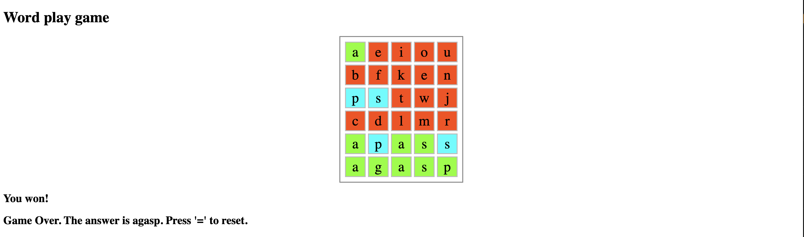

# WordPlay

WordPlay is a Wordle-style word guessing game, currently with a barebone UI. Players have to guess a 5-letter word within a limited number of attempts, with visual feedback provided for each guess.

## How to Play

- Type letters to make guesses
- Press **Enter** to submit your guess
- Press **Backspace** to delete letters
- Press **=** to reset the game
- Colors indicate:
  - **Orange**: <div style="background-color:orangered"> Letter not in the word.</div>
  - **Blue**: <div style="background-color:aqua"> Letter in word but wrong position </dic>
  - **Green**: <div style="background-color:chartreuse"> Letter in correct position</div>



## Features

- **Dynamic Word Generation:** Fetches random words from the Datamuse API
- **Game State Management:** Built with Redux Toolkit for reliable state management


## Getting Started

1. Clone the repository:
    ```bash
    git clone https://github.com/tedzhao/WordPlay.git
    ```
2. Navigate to the project directory:
    ```bash
    cd wordplay
    ```
3. Install dependencies:
    ```bash
    npm install
    ```
4. Create a `.env` file with your configuration:
    ```env
    REACT_APP_WORD_LENGTH=5
    REACT_APP_WORD_ATTEMPTS=6
    ```
5. Start the development server:
    ```bash
    npm start
    ```


## Docker Support

Build and run with Docker:

```bash
# Build the image
docker build -t wordplay-app .

# Run the container
docker run -p 3000:80 wordplay-app
```


## Project Structure

```
src/
├── states/
│   ├── slice/
│   │   └── GameSlice.ts    # Redux game state management
│   └── store.ts            # Redux store configuration
├── App.tsx                 # Main application component
├── App.css                 # Application styles
└── index.tsx              # Application entry point
```

## TODO

1. Adding difficulty levels by word frequency.
2. Much much better UI

## Contributing

Contributions are welcome! Please feel free to submit a Pull Request.

